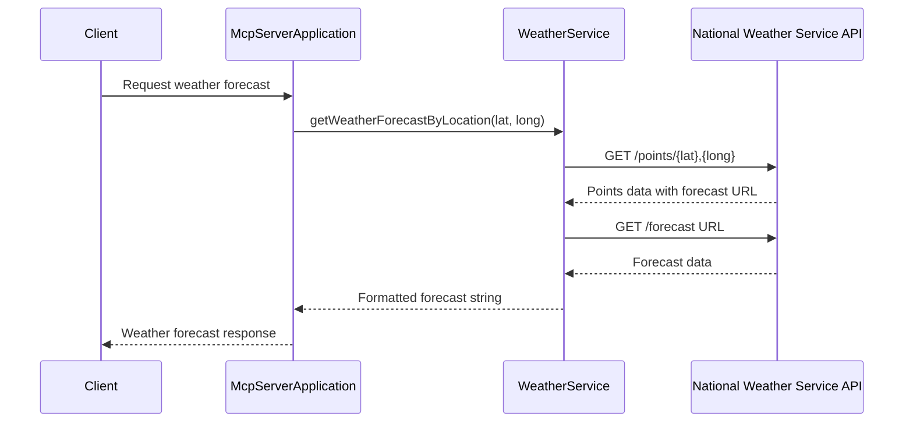
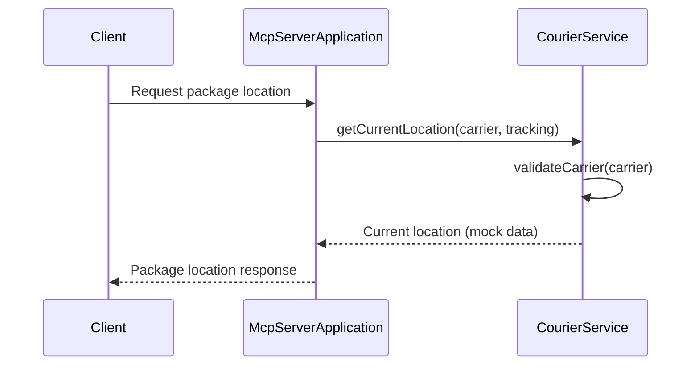

# Java MCP Tools Architecture

## Class Diagram
```mermaid
classDiagram
    class McpServerApplication {
        +main(String[] args)
        +weatherTools(WeatherService) ToolCallbackProvider
        +courierTools(CourierService) ToolCallbackProvider
        +toUpperCase() ToolCallback
    }
    class WeatherService {
        -RestClient restClient
        +getWeatherForecastByLocation(double latitude, double longitude) String
        +getAlerts(String state) String
    }
    class CourierService {
        +getCurrentLocation(String carrier, String trackingNumber) String
        +getEstimatedDelivery(String carrier, String trackingNumber) String
        +getDeliveryStatus(String carrier, String trackingNumber) String
        -validateCarrier(String carrier) void
    }
    class Points {
        +Props properties
    }
    class Forecast {
        +Props properties
    }
    class Alert {
        +List<Feature> features
    }

    McpServerApplication --> WeatherService : uses
    McpServerApplication --> CourierService : uses
    WeatherService --> Points : creates
    WeatherService --> Forecast : creates
    WeatherService --> Alert : creates
    CourierService --> "TrackingResponse" : creates

    note for WeatherService "Handles weather forecasts and alerts\nusing National Weather Service API"
    note for CourierService "Manages package tracking for\nFedEx and UPS carriers"
```

## Sequence Diagram - Weather Forecast Flow


## Sequence Diagram - Courier Tracking Flow

