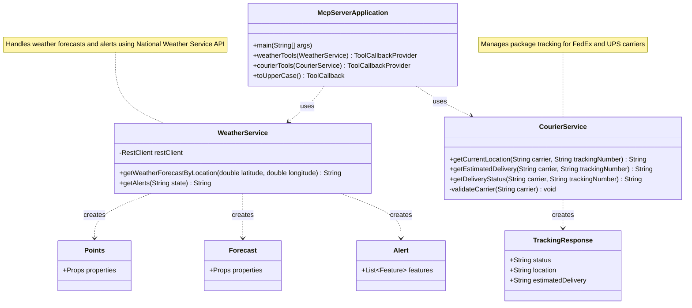

# Class Diagram

```mermaid
classDiagram
    class McpServerApplication {
        +main(String[] args)
        +weatherTools(WeatherService) ToolCallbackProvider
        +courierTools(CourierService) ToolCallbackProvider
        +toUpperCase() ToolCallback
    }
    class WeatherService {
        -RestClient restClient
        +getWeatherForecastByLocation(double latitude, double longitude) String
        +getAlerts(String state) String
    }
    class CourierService {
        +getCurrentLocation(String carrier, String trackingNumber) String
        +getEstimatedDelivery(String carrier, String trackingNumber) String
        +getDeliveryStatus(String carrier, String trackingNumber) String
        -validateCarrier(String carrier) void
    }
    class Points {
        +Props properties
    }
    class Forecast {
        +Props properties
    }
    class Alert {
        +List~Feature~ features
    }
    class TrackingResponse {
        +String status
        +String location
        +String estimatedDelivery
    }

    McpServerApplication ..> WeatherService : uses
    McpServerApplication ..> CourierService : uses
    WeatherService ..> Points : creates
    WeatherService ..> Forecast : creates
    WeatherService ..> Alert : creates
    CourierService ..> TrackingResponse : creates

    %% Service descriptions
    note for WeatherService "Handles weather forecasts and alerts using National Weather Service API"
    note for CourierService "Manages package tracking for FedEx and UPS carriers"
```
