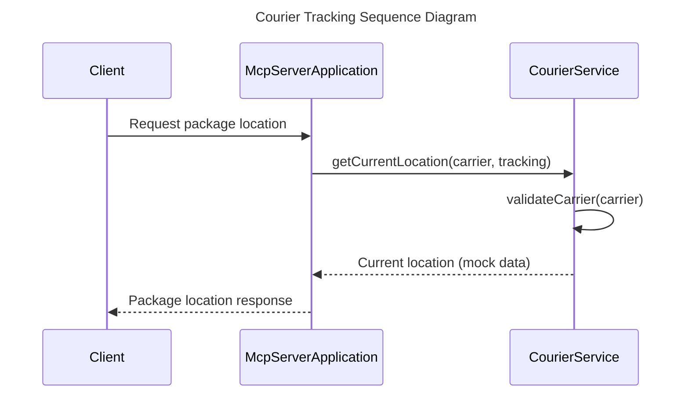

# Courier Tracking Flow

```mermaid
---
title: Courier Tracking Sequence Diagram
---
sequenceDiagram
    participant Client
    participant MCP as McpServerApplication
    participant CS as CourierService

    Client->>MCP: Request package location
    MCP->>CS: getCurrentLocation(carrier, tracking)
    CS->>CS: validateCarrier(carrier)
    CS-->>MCP: Current location (mock data)
    MCP-->>Client: Package location response
```
