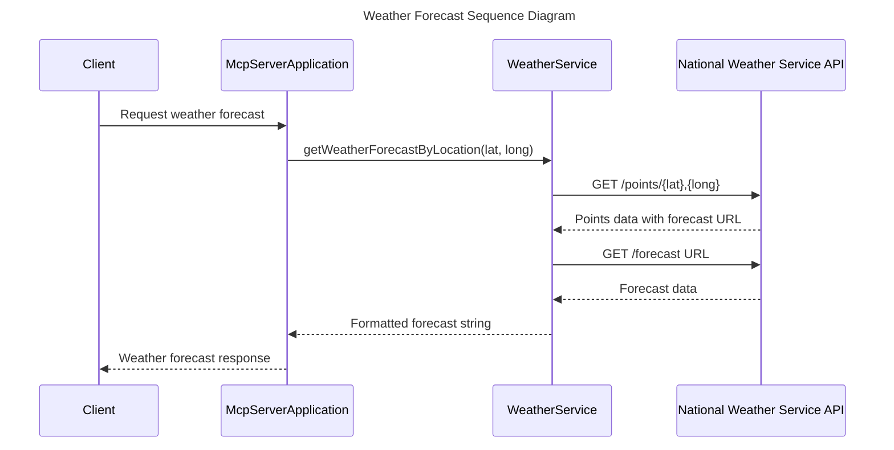

# Weather Forecast Flow

```mermaid
---
title: Weather Forecast Sequence Diagram
---
sequenceDiagram
    participant Client
    participant MCP as McpServerApplication
    participant WS as WeatherService
    participant NWS as National Weather Service API

    Client->>MCP: Request weather forecast
    MCP->>WS: getWeatherForecastByLocation(lat, long)
    WS->>NWS: GET /points/{lat},{long}
    NWS-->>WS: Points data with forecast URL
    WS->>NWS: GET /forecast URL
    NWS-->>WS: Forecast data
    WS-->>MCP: Formatted forecast string
    MCP-->>Client: Weather forecast response
```
